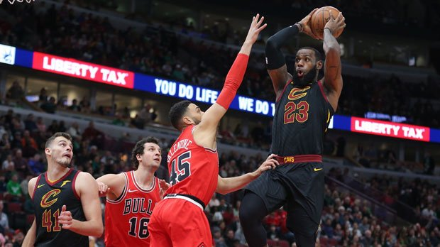
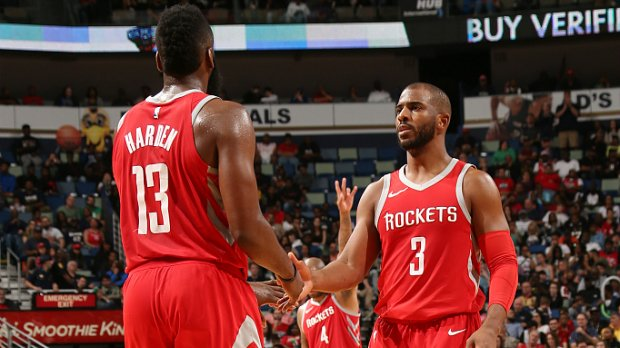

<!-- TOC -->

- [1. 通过透明度切换显示效果](#1-通过透明度切换显示效果)

<!-- /TOC -->

# 1. 通过透明度切换显示效果

    这个是没有动画效果的 图片 切换,但这个是 一个基础吧,如果要写动画的话 可以在 这个基础上 再添加效果.

    首先 展示以下 HTML + CSS 代码,这个不是重点,主要是JS代码：

```html
<style>
/* 去除掉 默认样式  */
* {
    padding: 0;
    margin: 0;
}
/* 父级框 大小 并居中 */
#container{
    width: 700px;
    height: 393px;
    position:relative;
    margin:0 auto;
}
/*图片大小*/
img {   
    width: 700px;
}
/* 图片的父级大小 去除默认样式 并设置相对定义  因为它的子级 会用到绝对定位*/
.banner{
    list-style: none;
    width:700px;
    height:393px;
    position:relative;
}
/* 子级绝对定位,让所有的图片都重叠在一起,然后 切换透明度 */
.banner li{
    position:absolute;
    opacity:0;
    left:0;
    top:0;
}
/* 图片下面的文字 样式及定位*/
.banner li p{
    color:#fff;
    font-size:20px;
    position:absolute;
    bottom:10px;
    left:0;
    text-indent:2em;
}
/* 设置一个类名 设置opcity:1 在要显示的 图片 添加 就ok了*/
.banner .current{
    opacity:1;
}

/* 左右点击按钮 上下居中 这个居中可以用 margin-top(计算以下就可以了) */
/* 或者 用百分比 50% 是父级的 百分之50,然后再减去 自身 高度的 一半*/
.left-btn,.right-btn{
    width:20px;
    height:50px;
    background:url("./img/btn.png") no-repeat;
    position:absolute;
    top:50%;
    margin-top:-20px;
    cursor:pointer;
}
/* 右按钮 设置定位  */
.right-btn{
    right:0;
    background-position:0 -200px;
}
/* 小圆点父级的样式 */
.circles{
    height:10px;
    position:absolute;
    width:130px;
    bottom:10px;
    list-style:none;
    left:70%;
}
/* 小圆点的样式 大小 圆环 背景颜色 间距 以及 手势 */
.circles li{
    width: 10px;
    height: 10px;
    border-radius:50%;
    background-color:#fff;
    margin: 0 8px;
    float:left;
    cursor:pointer;
}
/* 给小圆点 添加的类名 */
.circles .active{
    background-color:purple!important;
}
</style>

<div id="container">
    <ul class="banner">
        <li class="current">
            
            <p>哈登32+11+8保罗里程碑 火箭擒鹈鹕迎四连胜</p>
        </li>
        <li>
            
            <p>詹姆斯获生涯第70次三双 骑士胜公牛</p>                
        </li>
        <li>
            
            <p>勇闯天涯superX  无畏者驾到</p>                
        </li>
        <li>
            
            <p>社区-火箭已具备总冠军气质？</p>                
        </li>
        <li>
            
            <p>中超-上港客场5-2富力 武磊上演大四喜</p>                
        </li>
    </ul>
    <div class="left-btn"></div>
    <div class="right-btn"></div>
    
    <ul class="circles">
        <li class="active"></li>
        <li></li>
        <li></li>
        <li></li>
        <li></li>            
    </ul>
</div>
```

    以下为JS代码：
```js
// 获取页面元素,原生的JS需要先获取元素

// 左右按钮
var LeftBtn = document.querySelector(".left-btn");
var RightBtn = document.querySelector(".right-btn");        

// 需要切换的图片
var Banner = document.querySelector(".banner");
var Img = Banner.getElementsByTagName("li");

// 下面小圆点 
var Circle = document.querySelector(".circles");
var Li = Circle.getElementsByTagName("li");


// 定义一个信号量, 这个信号量在 连接 图片序号 和 小按钮 序号 有用处
var index = 0;

// 跳转到下标为 number 的图片
// 显示下一张图片 并且 图片对应的 按钮样式 也同时改变
function move(number){
    // 把第一张图片的序号 赋值给 index
    index = number;
    // 先设置所有的图片都隐藏
    for( let i = 0; i < Img.length; i++){
        Img[i].className = "";
    }
    // 再设置要显示的图片 显示
    Img[number].className = "current";

    // 同理 先清空所有的 小圆点 样式
    for(let j = 0; j < Li.length; j++){
        Li[j].className = "";
    }
    Li[number].className = "active";
}
// 点击右按钮的时候,切换index, 并把 index 传入 上面的函数
RightBtn.onclick = function(){
    index++;
    if(index >= 5){
        index = 0;
    }
    move(index);
}
// 同样的,点击左按钮的时候, 改变index后 传入 move() 函数
LeftBtn.onclick = function(){
    index--;
    if(index < 0){
        index = 4;
    }
    move(index);
}

// 小原点 mouseover 事件 
for(let i = 0; i < Li.length; i++){
    Li[i].index = i;
    Li[i].onmouseover = function(){
        move(this.index);
    }
}
```
    上述轮播图有两个注意事项：
    1. 在小按钮的mouseover事件时,首先需要保存好当前的按钮序号,因为 如果不保存的话, mouseover的时候循环已经完成了.
    2. 如果mouseover某个小圆点后,再点击 左右 切换按钮,是否能够对上次的 图片序号 有 '记忆'.

    第二点是难点, 首先声明了一个全局变量 index,表示 第几张图片.然后函数 需要传入一个变量,表示 切换到 第几张图片
    左右点击 按钮 切换图片不会遇到这个问题. 
    在 点击 小圆点的 时候 传入了 当前按钮的 序号,并且把 当前序号 赋值 给了 index.这样 下次点击时就 知道 刚才 鼠标
    经过的 小按钮是 第几个了 并在此基础上 切换.

    